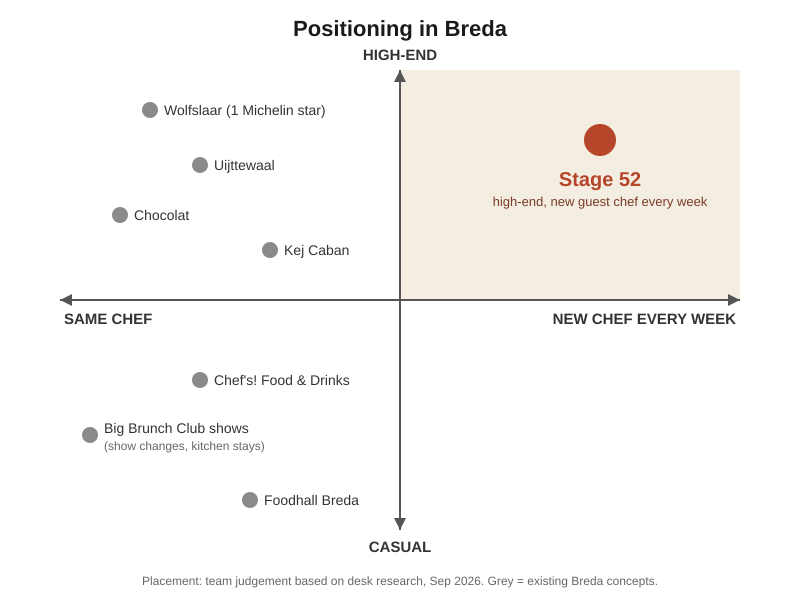

# Memo draft: concept section

*Draft v2, 15 Sep 2026. Owner: Ron. Research base: `team-up/research/desk-research-pop-up-chef-breda.md`. Citation style: APA 7. AI assistance: desk research, reference checking and first draft done with Claude, checked and edited by Ron.*

---

## Stage 52: a high-end guest-chef restaurant in Breda

*52 chefs, 52 verhalen.*

### The gap

Breda has plenty of places to eat well. It has Michelin-listed restaurants such as Wolfslaar, Uijttewaal and Chocolat (MICHELIN Guide, n.d.), new chef's-menu restaurants such as Kej Caban (Entree Magazine, n.d.), a food hall with 14 stalls (Explore Breda, n.d.) and ticketed shows at The Streetfood Club (Big Brunch Club, n.d.). In all of them the kitchen stays the same, and so do the menu and the story behind it.

Our desk research found **no restaurant in Breda where a different chef takes over the kitchen**. The format exists in London and Amsterdam, and as seasonal pop-ups elsewhere in the Netherlands, but not in Breda.

### The concept

- **The name.** In professional kitchens a "stage" is a chef's guest shift in someone else's kitchen; for guests it is a stage where a chef performs. 52 stands for the 52 weeks of the year: 52 guest chefs, each with their own story (verhaal).
- **The idea.** A high-end restaurant at one fixed location in Breda. Every week a new guest chef takes over with a short, limited menu, their own music and, if they want, the personal story behind the food. The venue, the service and the quality stay the same; the chef and the menu change.
- **The ticket.** One ticket, one price, paid in advance: the guest chef's menu plus "pick your drink". Nobody has to work out a bill at the end of the night. The price is set per guest chef, based on the chef's level, the dishes and the ingredients, so every week has its own price.

### Existing models

|  | **Model A: fixed venue, rotating chef** | **Model B: travelling or seasonal pop-up** |
|---|---|---|
| **How it works** | One permanent restaurant; the host provides kitchen, staff and drinks, the guest chef brings the menu and their own followers (Finney, 2022; Morrissy-Swan, 2024). | The restaurant moves to a special location for a few weeks or a season. |
| **Examples** | **Carousel, London:** a new guest chef every week, more than 350 chefs so far (Carousel-London, n.d.). **Bottleshop Chefcounter, Amsterdam:** a wine shop and restaurant that showcases travelling chefs (Emma, 2024). | **De Maaltuin:** a travelling restaurant at castles, palaces and gardens; the ticket includes aperitif, five courses and a drinks or mocktail arrangement (De Maaltuin, n.d.), from EUR 124.95 at the Rotterdam edition (Bijzonder Uiteten, 2025). **Petit Péché, Zandvoort:** for 16 Sundays, guest chefs take over the terrace and kitchen (Koppert, 2026). |
| **Strength** | A known address that builds regulars; chefs do not have to find a venue. | The location itself is the attraction; no year-round fixed costs. |
| **Weakness** | The host carries the fixed costs. Carousel's co-founder: "economics are not life-changing, on either side" (Finney, 2022). | Guests have to find the concept again every edition. |

**Stage 52 takes Model A to Breda** and borrows the all-in ticket from Model B.

### Positioning

Breda's high-end restaurants all work with their own chef. The casual places with variety (the food hall's 14 stalls, the changing ticketed shows) also keep the same kitchen. **Stage 52 is the only concept in the top-right corner: high-end, with a new chef every week.** Placement is our own judgement based on the desk research above.

### Target group

**1. Breda residents aged 21+ without children**
- 71% of Breda's 92,225 households have no children: 44% are single-person households and 27% are multi-person households without children (AlleCijfers.nl, 2026).
- People aged 25-45 make up 27% of Breda's 190,204 inhabitants, and people aged 45-65 another 25% (AlleCijfers.nl, 2026).
- Why they fit: no babysitter to arrange, so a fixed evening seating works. Dutch consumers eat out less often and save it for special occasions (FoodService Instituut Nederland [FSIN], 2026); a weekly chef gives them a new occasion every week.

**2. Visitors**
- Breda had more than 5.3 million Dutch visitors in 2025, 9% more than in 2024. They came 4.1 times a year on average, against 3.2 nationally, and 70% of overnight tourists come for a city trip, an event or culture (Omroep Brabant, 2026).
- Why they fit: visitors already come back often. A chef who is only there that week gives every visit something they cannot get at home or on their last trip.

**Personas** *(illustrative, built from the figures above; not yet tested in interviews)*

| | **Sanne, 32, lives in Breda** | **Mark and Eva, 44 and 42, from Utrecht** |
|---|---|---|
| **Situation** | Lives with her partner, no children, works full time. | A weekend in Breda a few times a year for the city and its culture. |
| **Eating out** | Goes out less than before because it has become expensive; saves it for a birthday or a night with friends. | Want one dinner that feels special and belongs to that weekend. |
| **What she / they want** | An evening that feels like an event, with a price she knows in advance. | Something that is only in Breda, only that week. |
| **Why Stage 52** | A new chef and a new story every week, one ticket, pick your drink. | A limited guest chef they can book ahead as part of the trip. |

### Why now

- **People eat out less often, but spend more when they do.** In Q2 2026 Dutch consumers visited restaurants 3.8% less often than a year earlier, while spending per visit rose 1.8%; eating out is increasingly saved for special occasions (FSIN, 2026).
- **A clear story wins.** Guests want a total experience of atmosphere, story and emotion, and "premium mediocre" concepts without a clear identity are losing out. The share of Millennials and Gen Z who eat out weekly halved from 50% to 25% in two years, so every visit has to count (Horecava, 2025).
- **Choice of drink matters.** Dutch restaurants report that more guests order an alcohol-free pairing even when they do not have to (de Bruijne, 2022). "Pick your drink" keeps the ticket attractive to drinkers and non-drinkers alike.
- **A prepaid ticket fixes a real problem.** 88% of Dutch restaurant operators have no-shows at least monthly, but only 22% ask for prepayment (Lightspeed, 2025). A ticket sold in advance means the guest chef cooks for a known number of guests.

### Price range

The ticket price varies per guest chef. For reference: ticketed shows at The Streetfood Club Breda start at EUR 56 all-in (Big Brunch Club, n.d.), De Maaltuin's all-in pop-up ticket starts at EUR 124.95 (Bijzonder Uiteten, 2025), and Wolfslaar (1 Michelin star) averages about EUR 130 per person (WijnSpijs, n.d.).

---

### References

AlleCijfers.nl. (2026, September 7). *Statistieken gemeente Breda*. Retrieved September 15, 2026, from https://allecijfers.nl/gemeente/breda/

Big Brunch Club. (n.d.). *Big Brunch Club | Shows bij The Streetfood Club Breda*. Retrieved September 15, 2026, from https://bigbrunchclub.nl/locaties/the-streetfood-club-breda/

Bijzonder Uiteten. (2025, July 18). *Popup restaurant de Maaltuin - Botanische tuin Rotterdam*. https://bijzonderuiteten.nl/food-event/maaltuin-botanische-tuin-rotterdam/

Carousel-London. (n.d.). *Guest chefs*. Retrieved September 15, 2026, from https://carousel-london.com/guest-chefs/

de Bruijne, I. (2022, July 21). Creatieve uitdaging: 'Opvallen met alcoholvrije pairings'. *Entree Magazine*. https://www.entreemagazine.nl/dranken/creatieve-uitdaging-opvallen-met-alcoholvrije-pairings

De Maaltuin. (n.d.). *Pop-up restaurant*. Retrieved September 15, 2026, from https://www.demaaltuin.nl/pop-up-restaurant/

Emma. (2024, May 19). *7 of the best culinary pop-up events and chefs to keep an eye on this year*. Your Little Black Book. https://www.yourlittleblackbook.me/en/pop-up-restaurants-amsterdam-chefs/

Entree Magazine. (n.d.). *Nieuwe restaurants Breda: 13 hotspots die je wilt zien*. https://www.entreemagazine.nl/culinair-chefs/nieuwe-restaurants-breda

Explore Breda. (n.d.). *World cuisines under one roof: Foodhall Breda*. https://www.explorebreda.com/en/blogs/world-cuisines-under-one-roof-foodhall-breda

Finney, C. (2022, December 13). Be my guest: the rise in chef residencies in London and beyond. *Foodism*. https://foodism.co.uk/features/guest-chef-residencies/

FoodService Instituut Nederland. (2026, July 31). *FSIN FoodPulse: Nederlander gaat minder vaak uit eten, maar besteedt meer per bezoek*. https://fsin.nl/nieuws/fsin-foodpulse-nederlander-gaat-minder-vaak-uit-eten

Horecava. (2025, December 3). *Horecava Trendreport 2026: betaalbare luxe en duurzaamheid transformeren de horeca*. Duurzaam Ondernemen. https://www.duurzaam-ondernemen.nl/horecava-trendreport-2026-betaalbare-luxe-en-duurzaamheid-transformeren-de-horeca/

Koppert, L. (2026, August 20). *De leukste pop-up restaurants door heel Nederland – de 2026 editie*. Barts Boekje. https://www.bartsboekje.com/pop-up-restaurants-nederland/

Lightspeed. (2025, February 13). *88 procent horecaondernemers heeft regelmatig last van no-shows*. https://www.lightspeedhq.nl/nieuws/no-shows/

MICHELIN Guide. (n.d.). *Breda MICHELIN restaurants*. Retrieved September 15, 2026, from https://guide.michelin.com/us/en/noord-brabant/breda/restaurants

Morrissy-Swan, T. (2024, May 3). How guest chef residencies took hold of London. *Club Oenologique*. https://cluboenologique.com/story/guest-chef-residencies-london/

Omroep Brabant. (2026, April 4). *Breda populair bij toeristen: vaker herhaalbezoek*. https://www.omroepbrabant.nl/nieuws/6006220/breda-populair-bij-toeristen-vaker-herhaalbezoek

WijnSpijs. (n.d.). *Restaurant Wolfslaar\* Breda (alle info)*. Retrieved September 15, 2026, from https://www.wijnspijs.nl/restaurant/397/breda-wolfslaar/

---

### Check before handing in
- **Bijzonder Uiteten** page gave a server error; title and date were read from the page code. Open it in a browser.
- **Entree Magazine (de Bruijne)** date 21 July 2022 came from page code; confirm in a browser.
- **Omroep Brabant** article is marked "AI Redactie" and based on BredaNu/NBTC figures. If possible, replace with the NBTC or BredaNu source.
- **WijnSpijs** in Word: remove the backslash and italicise the whole title including the star.
